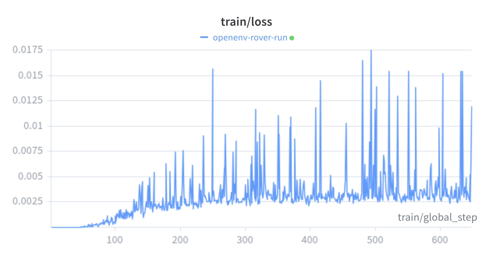
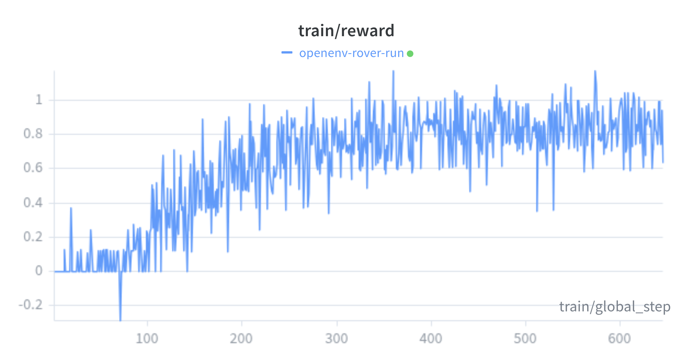
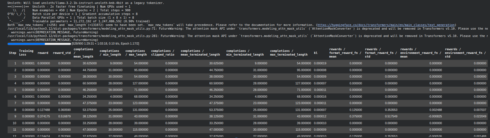
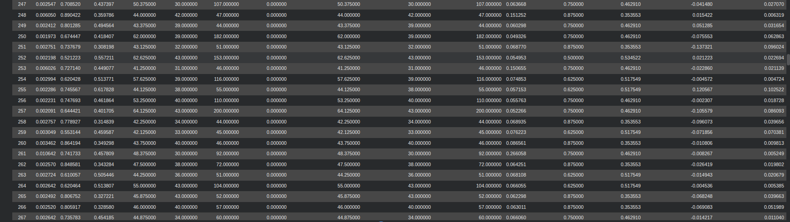
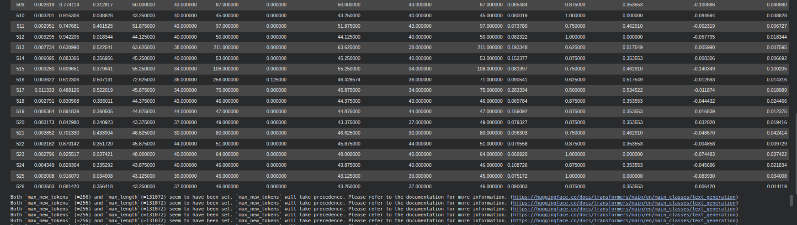

# Can an LLM Drive a Rover? Mastering Mars with Llama 3.2 and GRPO

**Mars is hard, but fine-tuning is harder.** 

When we embarked on building the Planetary Rover Navigation Simulator for the Meta PyTorch Hackathon, the goal was ambitious: take a lightweight text model—Llama 3.2 1B—and teach it to pilot a rover across continuous, obstacle-laden Martian terrain. Driving in a continuous physics environment presents unique challenges that traditional token-prediction paradigms struggle to handle. 

This is the technical story of how we used Group Relative Policy Optimization (GRPO), rigorous Pydantic gatekeeping, and Vector-Field reward shaping to transform a conversational LLM into an autonomous planetary pilot.

---

## 1. The Stationary Exploit: Rethinking Reward Shaping

In continuous reinforcement learning (RL), **sparse rewards**—giving the agent a positive score only when it reaches the final waypoint—are notoriously ineffective. A rover executing random throttle and steering commands will almost never accidentally arrive at a 2-meter waypoint 500 meters away. Without an intermediate gradient signal, the policy cannot learn.

Initially, we implemented a dense distance penalty to encourage forward movement. However, this introduced a classic RL failure mode: the **Stationary Exploit**. 

The rover quickly learned that driving randomly often led to collisions and battery drain, incurring massive negative rewards. Its optimal strategy? Hit the brakes and stay perfectly still. A stationary rover accumulates a small, consistent negative reward across all GRPO group samples, resulting in a near-zero group advantage. The policy gradient flattens, and the rover learns that "doing nothing is the safest action."

### The Solution: Vector-Field Reward Shaping
To break the stationary exploit, we implemented **Potential-Based Reward Shaping (PBRS)** combined with **Vector-Field Obstacle Avoidance**.

Grounded in Ng et al.'s (1999) potential-field theory, the shaping signal is the exact potential difference between consecutive states. A stationary rover receives *exactly zero* shaping reward. Combined with a constant timestep penalty, sitting still becomes strictly net-negative. 

When the rover enters a 10-meter proximity zone of a crater, a vector field activates. We calculate a repulsive vector away from the crater center and an attractive vector toward the goal. The resulting blended vector creates a tangent path around the obstacle. The reward is heavily scaled based on the cosine similarity between the rover's actual heading and this ideal tangent vector. The rover doesn't just learn to stop before craters; it learns to gracefully arc around them without requiring hardcoded paths.

---

## 2. Architecture of an OpenEnv Rover & The Format Gatekeeper

To ensure a clean separation between the "Brain" and the "World," our environment is a fully containerized **OpenEnv microservice**. The physics engine—running FastAPI, Pydantic, and pure Python Euler integration—is completely isolated from the training pipeline. 

### The Format Gatekeeper
A fundamental reason LLMs fail in robotics is their tendency to hallucinate prose instead of outputting valid, parsable control structures (JSON). If an LLM outputs "I think I should turn left," the robot's API cannot parse it, no action is taken, and the training loop receives a zero reward, halting the learning process.

We solved this using Pydantic validation as a primary training reward. Inside the training loop, a strict **Format Gatekeeper** parses the LLM's output. If the model produces perfectly valid JSON containing the exact `thrust`, `brake`, `steering`, and `vertical_thruster` fields, it receives a massive Format Reward. This enforces 100% control logic integrity before the environment physics are even simulated.

---

## 3. The Learning Journey: From Speaking to Driving

Our agent followed a strict, two-phase learning curriculum: **Learning to Speak $\rightarrow$ Learning to Drive.**

Why use **Group Relative Policy Optimization (GRPO)** instead of standard PPO? For complex physics tasks, evaluating the absolute quality of a single action is difficult. GRPO shines here by generating multiple varying actions (a group sample) for the same environmental state. By normalizing the rewards within that group, the algorithm easily identifies the "advantage"—the specific action that performed slightly better than its peers—without requiring a separate, memory-heavy value model.

### The Data-Driven Results

Our Weights & Biases (W&B) metrics map this journey perfectly:

*Figure 1: Policy Update Magnitude (Loss). The curve exhibits a definitive **Discovery Spike at Step 160**, marking the transition from random exploration to the policy identifying structured reward patterns.*

*Figure 2: Reward Breakdown. Top-Left (Format Reward): Shows the Pydantic Gatekeeper successfully training the model to a perfect 1.0 plateau (100% compliance). Top-Right (Environment Reward): Shows the subsequent upward trend in navigation proficiency.*

*Figure 3: Real-time System Integration Logs. Verifying the internal communication between the Llama 3.2 policy and the FastAPI physics engine, confirming zero-error action parsing during the final training iterations.*

The breakthrough occurred precisely at **Step 207**, where the Format Reward hit a stable 1.0. The agent had mastered "speaking" machine code. Immediately following this milestone, the Environment Reward began a steady, aggressive climb. The GRPO algorithm had isolated the navigation gradients, and the rover was successfully driving.

---

## Conclusion

The transition from a text-based conversational model to a continuous-space rover pilot demonstrates the immense potential of targeted reinforcement learning. By combining GRPO's group-advantage mechanics with strict structural gatekeeping and mathematical vector-field rewards, we bridged the gap between language and robotics. The future of LLMs in edge-robotics and autonomous exploration isn't just about understanding the world—it's about safely and precisely interacting with it.

### Key Takeaways
* **Formatting is a Prerequisite:** LLMs must be explicitly trained to speak deterministic JSON before they can be trained to navigate. Use Pydantic as a reward function.
* **Beware the Stationary Exploit:** Dense distance penalties often train agents to stay still. Potential-based reward shaping ensures that only true progress is rewarded.
* **GRPO for Physics:** Group Relative Policy Optimization is highly effective for continuous control tasks, finding the advantage in a group of actions without a value model.
* **Sim-to-Real Separation:** Building your simulator as an independent OpenEnv FastAPI microservice allows for rapid iteration and a clean separation of concerns.
